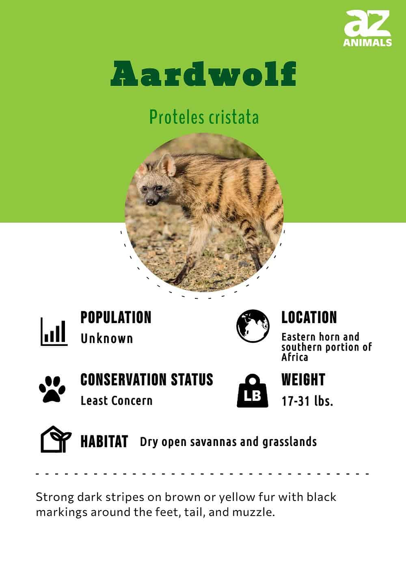

- **Aardwolves**:
  - Play a positive ecological role by controlling termite populations.
  - Shy, elusive, and nocturnal; rarely seen by people.
  - Name \"aardwolf\" means \"earth wolf\" in Afrikaans and Dutch but is not related to wolves; it belongs to the hyena family.

- **Differences from Hyenas**:
  - Smaller in size.
  - Live in smaller family units.
  - Feed on insects, primarily termites, instead of carrion or larger prey.

- **Interesting Facts**:
  - Adapted for eating termites with blunt teeth and powerful jaws for defense.
  - Alternative name \"maanhaar-jackal\" means \"mane-jackal\" in Dutch, though not related to jackals.
  - Territorial behavior includes raising their manes and chasing intruders; fights are rare.

- **Scientific Classification**:
  - Scientific name: *Proteles cristata*.
  - Two subspecies: *Proteles cristatus cristatus* (Southern Africa) and *Proteles cristatus septentrionalis* (Eastern and northeastern Africa).
  - Part of the Hyaenidae family; once thought to be a separate family.

- **Evolution**:
  - Considered a \"primitive\" hyena, diverged from other hyenas 15-32 million years ago.

- **Appearance**:
  - Dark stripes on brown or yellow fur, thick mane, and large ears.
  - Smallest hyena species, 3 feet long, weighing 17-31 pounds.
  - Five toes on front feet, unlike most hyenas.

- **Behavior**:
  - Social structure based on family units; rarely forms larger packs.
  - Communicate through scent markings and minimal vocalizations.
  - Nocturnal foragers; consume up to 300,000 termites per night.
  - May share territory or hunt in small groups when food is scarce.

- **Habitat**:
  - Prefers dry savannas and grasslands with minimal rainfall.
  - Found in Eastern Africa (Ethiopia, Somalia, Kenya) and Southern Africa (Angola, Zambia, South Africa).

- **Predators and Threats**:
  - Few natural predators; young aardwolves are vulnerable to jackals, lions, leopards, and hyenas.
  - Threats include hunting, motor accidents, and habitat loss.

- **Diet**:
  - Mainly termites; also eat beetles and other insects if termites are unavailable.
  - Immune to termite toxins.

- **Reproduction**:
  - Breeding peaks in rainy months; pair bonds form.
  - After a 90-day gestation, 2-5 pups are born, raised in underground dens.
  - Pups are weaned after 3-4 months and fed regurgitated termites.

- **Population**:
  - Classified as \"Least Concern\" by IUCN Red List; population numbers are healthy but hard to estimate due to their elusive nature.
  - Low population density; one breeding pair occupies 1-4 square kilometers.
Here's a concise summary of the aardwolf information:

### Overview:
- **Role in Ecosystem**: Controls termite populations.
- **Family**: Hyena family (Hyaenidae), not actually a wolf.

### Comparison with Hyenas:
- **Size**: Smaller than other hyenas.
- **Diet**: Insects (mainly termites), not carrion.
- **Social Structure**: Lives in smaller family units.

### Fascinating Facts:
- Teeth evolved to eat termites, with blunt pegs for chewing.
- Also known as \"maanhaar-jackal\" (mane-jackal) in Dutch.
- Territorial, uses mane as a warning signal, avoids fights if possible.

### Scientific Classification:
- **Scientific Name**: *Proteles cristata*
  - *Proteles*: Greek for \"complete in front\" (refers to toes).
  - *Cristata*: Latin for \"comb\" (refers to mane).
- **Subspecies**:
  - *Proteles cristatus cristatus* (Southern Africa)
  - *Proteles cristatus septentrionalis* (Eastern and northeastern Africa)

### Evolution:
- Considered a \"primitive\" hyena, diverged from other hyenas 15-32 million years ago.

### Appearance:
- **Features**: Dark stripes, thick mane, large ears.
- **Size**: 3 feet long, 17-31 pounds.
- **Toes**: Five on front feet, unlike other hyenas.

### Behavior:
- **Social Structure**: Family units; does not form large packs.
- **Communication**: Scent markings, minimal vocal sounds.
- **Feeding**: Nocturnal; consumes up to 300,000 termites nightly.
- **Territory**: May share or hunt in small groups when food is scarce.

### Habitat:
- **Preferred Environment**: Dry savannas and grasslands.
- **Range**: Eastern Africa (Ethiopia, Somalia, Kenya) and Southern Africa (Angola, Zambia, South Africa).

### Threats and Predators:
- **Predators**: Jackals, lions, leopards, other hyenas, hunting dogs.
- **Threats**: Hunting, motor accidents, habitat loss.

### Diet:
- **Primary Food**: Termites; also beetles and other insects if termites are scarce.

### Reproduction:
- **Mating Season**: Peaks during rainy months; pair bonds form.
- **Gestation**: About 90 days; births 2-5 pups.
- **Puppy Development**: Fed on mother’s milk; learns to hunt in the first year.

### Population:
- **Conservation Status**: Least Concern (IUCN Red List).
- **Population Density**: Low; territory of 1-4 square kilometers per pair.

